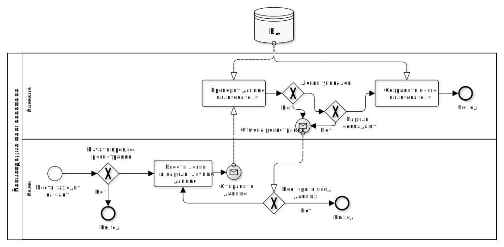
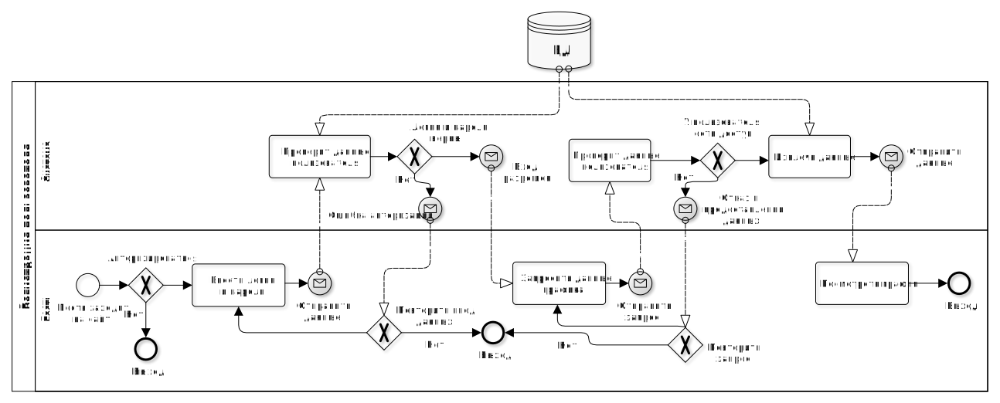

# Электронный дневник ediary

### Краткое описание идеи проекта

Сервер для ведения дневника онлайн с встроенным сбором статистики (настроения, времени подъема, общей оценки продуктивности) и построением графиков.

### Краткое описание предметной области

Предметная область данного проекта – дневники, самоконтроль, сбор и анализ статистики.

### Краткий перечень функциональных требований

1. Регистрация и авторизация;
2. Просмотр, создание, удаление записей дневника;
3. Построение графиков по данным пользователя.

### Целесообразность и актуальность проекта

Мир ускоряется, времени для рефлексирования и самоконтроля все меньше, как следствие нужен инструмент, который поможет человеку оценивать свое состояние и его динамику.

### Use-Case


### Модель БД


## ER диаграмма в нотации Чена


### Описание акторов

В проекте представлены следующие акторы:

1. Владелец – может выполнять все операции со своим дневником;
6. Гость – незарегистрированный пользователь.

### Пользовательские сценарии

- Составление записи в дневнике:
  1. Пользователь заходит в меню ведения дневника;
  3. Пользователь оставляет записи и просматривает старые;
  4. Пользователь сохраняет дневник.
- Ввод параметров статистики:
  1. Пользователь заходит в меню ведения дневника;
  2. Переходит в меню сбора статистики;
  3. Отвечает на простые вопросы (настроение по 10-бальной шкале уровень продуктивности, время, когда пользователь лег спать и проснулся);
  4. Сохраняет ответы.
- Просмотр графиков:
  1. Пользователь переходит в меню просмотра статистики;
  2. Пользователю отображаются данные.

## Технологический стек

- Тип приложения: web-приложение;
- язык:
  - backend: Java + Spring Boot;
  - frontend: typescript + Vue.js;

- СУБД: PostgreSQL;
- способ доставки: docker.

## BPMN диаграмма

##### Регистрация пользователя



##### Просмотр графика настроения



##### Редактирование записи


### Верхнеуровневое разбиение на компоненты

Приложение будет состоять из 4 компонентов:

- компонент реализации UI;
- компонент обработчиков запросов;
- компонент реализации бизнес-логики (Business Logic);
- компонент доступа к данным (Data Access).


## UML диаграмма классов


## RESTFul api

[Внешнее API в формате OpenAPI]: ./OPENAPI.md

### Запуск тестов

Для локальной запуски тестов необходимо:

```bash
cd backend
gradle uTest # юнит тесты
gradle iTest # интеграционные тесты
gradle eTest # e2e тесты
gradle aTest # генерация allure отчета
gradle test # запуск всех тестов
```

Для запуска ci-процесса:

```bash
./cicd/ci-local.sh # необходимо наличие docker
```

Для сборки контейнера CI:

```bash
docker-compose -f ./cicd/docker-compose.test.yml -p ediary_cicd up --build -d
```

